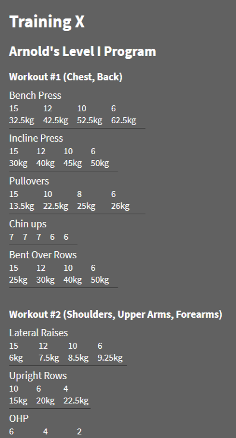

# Training X

Web app for recording my training routine progress.

_Made with Nuxt.js and Vue.js._



## Backlog

-   Standardise font sizes
-   Replace inputs with selectable reps/weight and one main increment/decrement
-   Redesign UI
-   Add/delete exercises
-   Add/delete workouts
-   Edit notes

## Nuxt Commands

```bash
# install dependencies
$ npm install

# serve with hot reload at localhost:3000
$ npm run dev

# generate static project
$ npm run generate
```

For detailed explanation on how things work, check out [Nuxt.js docs](https://nuxtjs.org).
